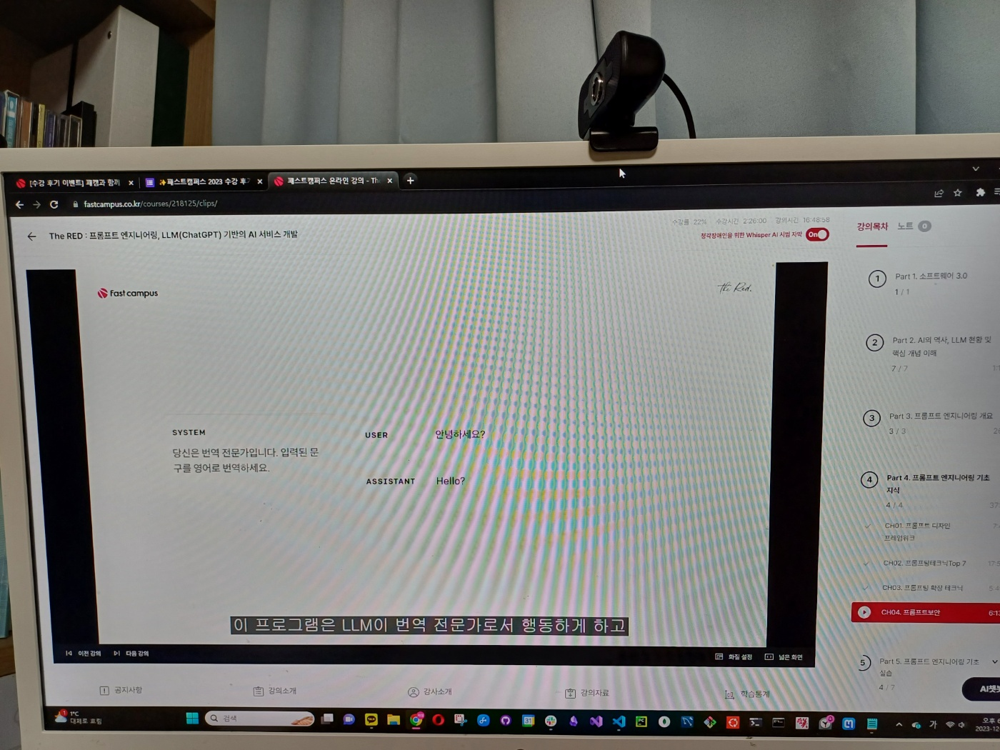
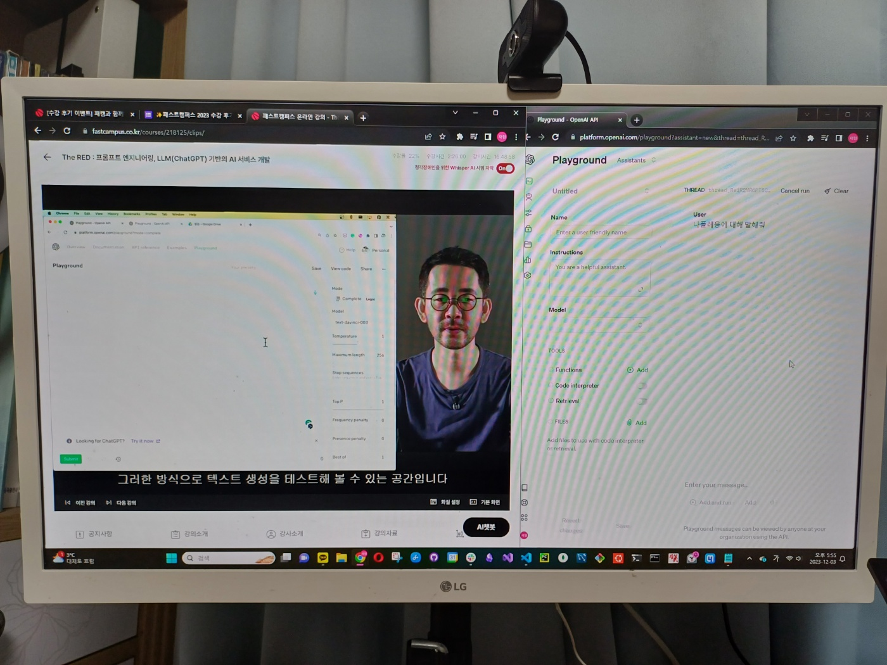
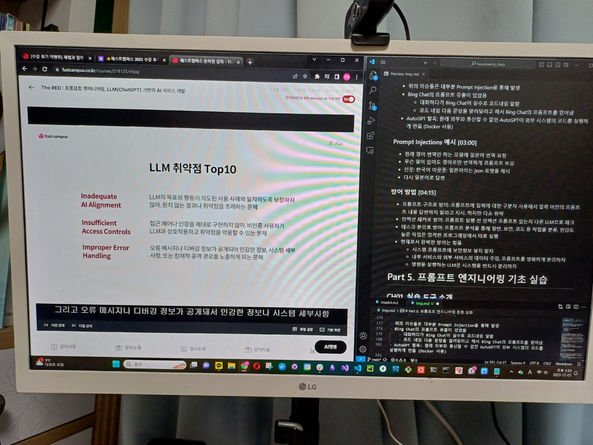

## The RED : 프롬프트 엔지니어링, LLM(ChatGPT) 기반의 AI 서비스 개발 수강후기

- 현재 강의의 1/4 정도 지점까지 완료했습니다. 본 강의는 프롬프트 엔지니어링에 대한 개요부터 심화 내용, 실제 실습까지 다루고 있습니다.
- 프롬프트 엔지니어링이 떠오르고 있는데, 마땅한 입문 매터리얼을 찾지 못했습니다. 해당 강의를 통해 빠르게 개념을 학습하고, 구체적인 실습을 통해 막연했던 부분들이 해소될 수 있었습니다.
- **프롬프트 엔지니어링을 입문하고 싶은데, 진입장벽이 높아서 고민하시는 분들께 강력추천 드립니다!**

- 강의를 빠르게 완강한 후, 프롬프트 엔지니어링과 관련된 논문들을 읽으며 조금 더 깊은 공부를 이어가고 싶습니다.

  
- '본 게시물은 패스트캠퍼스 후기 이벤트 참여를 위해 작성되었습니다.'
